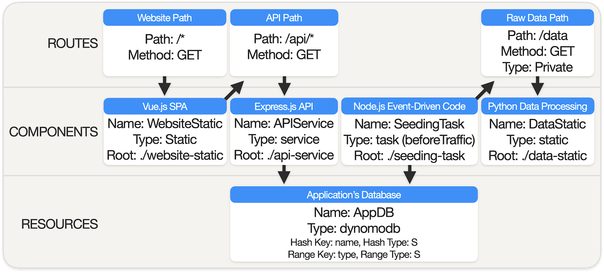

# Noop Sample Application | COVID-19 Mobility Dashboard

### Table of Contents

- [What is Noop?](#what-is-noop)
- [The Sample Application](#the-sample-application)
- [Noop Desktop Quick Start](#noop-desktop-quick-start)
  - [Prerequisites for running Noop Desktop](#prerequisites-for-running-noop-desktop)
  - [Launch Sample Application in Noop Desktop](#launch-sample-application-in-noop-desktop)
- [Noop Cloud Quick Start](#noop-cloud-quick-start)
  - [Prerequisites for deploying on Noop Cloud](#prerequisites-for-deploying-on-noop-cloud)
  - [Launch Sample Application on Noop Cloud](#launch-sample-application-on-noop-cloud)

## What is Noop?

Noop is a platform which makes it easy to develop, build, run, and deploy your applications. In essence, Noop streamlines setting up and maintaining a cloud-based infrastructure for hosting your application. All you need to do is provide a Noopfile(s) to explain the configuration of your application, and Noop will take care of the rest.

Noop currently provides two distinct runtime environments, Noop Desktop and Noop Cloud. Noop Desktop helps facilitate local development of Noop project, while Noop Cloud is a platform to run Noop applications in the cloud.

With that said - let's get started!

## The Sample Application

To an end-user, the sample application featured in this repository delivers a data visualization dashboard offering insight into mobility during the COVID-19 pandemic. Moreover, the application serves as away to illustrate how simple it is to create complex relationships between disparate portions of a project using the **Noop App Model**.

Source code for the sample application is divided into four subdirectories at the root of the project. These four subdirectories each contain source code for an individual Noop component. Each component is defined by a **Noopfile** located at its own root level. The sample application's Noopfiles also define a **DynamoDB database resource**, `AppDB`, which serves as a dependency accessible to the application's components.

The sample application's Noop components include:

1. `DataStatic`, a Python **static component**, which processes raw data files into a seed data file.

2. `SeedingTask`, a Node.js **task component**, which checks valid entries in `AppDB`, and seeds data if needed.

3. `APIService`, an Express.js API **service component**, which facilitates communication between `AppDB` and `WebsiteStatic`.

4. `WebsiteStatic`, a Vue.js SPA **static component**, which manages the client-side user interface.

Examining the source code of the sample application will be helpful for familiarizing yourself with Noop specific development practices. Otherwise interacting directly with the source code is not necessary to proceed with running it on Noop.

## Noop Desktop Quick Start

Noop Desktop is an all-encompassing local development application, which assists with running projects in their production state on your local machine. Features include a dashboard interface for easy inspection of a running project, and auto-rebuilding of individual components in a project upon source code changes.

#### Prerequisites for running Noop Desktop

In order to run the sample application with Noop Desktop, [Docker](https://www.docker.com) needs to be installed and running on your local machine. **Note:** At this time Noop Desktop is only compatible with macOS. 

#### Launch Sample Application in Noop Desktop

**1) Install Noop Desktop**

If Noop Desktop has yet to be be installed on your local machine, [click here](https://noop.app/download).

**2) Git Clone the Sample Application**

Clone the sample application's git repository onto your local machine by running `git clone https://github.com/noop-cloud/noop-sample-app-covid-19-mobility.git`.

**3) Run Docker**

Make sure Docker is running on your local machine. You can confirm by entering `docker ps` into your terminal window.

**4) Run Noop Desktop**

Open Noop Desktop, and click to icon labeled "Local Development" in the bottom section of the left-hand sidebar. Press "New Project", provide a name for your project, and select the folder containing the sample application on your local machine. Upon being directed to the project's Overview page, click the "Start" button to build and run the sample application.

In order to access a running project in an external client, an associated endpoint is needed. On the project's Overview page press "New Endpoint", and enter in a domain name. The newly created endpoint now be used to access the running project on your local machine.

To stop a running project, click the "Stop" button on the project's Overview page.

## Noop Cloud Quick Start

[Noop Cloud](https://noop.app) is a PaaS provider designed for hosting and managing Noop applications. Noop Cloud strives to streamline the process of setting up and deploying your application, while also retaining a robust set of configuration options.

#### Prerequisites for deploying on Noop Cloud

In order to launch the sample application on Noop Cloud, the source code within this repository needs to be "forked" or cloned into your own GitHub account. You also need to sign up for a [Noop Cloud](https://noop.app/) account to grant Noop Cloud access to the Noop application.

#### Launch Sample Application on Noop Cloud

**1) Create App**

Visit [Noop Cloud](https://noop.app/), and click on the **Applications** icon in the left-hand sidebar. Then click **Create New App**, and select the repository that contains the sample application's source code. Click **Go to App** to continue.

**2) Create Build**

Select the "Builds" tab. Under the **Initiate Manual Build** section enter in a **Git Reference** (e.g. `master`) to create a build of the sample application. Click **Build** and you will be directed to this specific Build's page. Wait for your build status to be listed as **Completed** before launching an environment.

**3) Launch Environment**

Return to the management page for the application, select the **Environment** tab, and click **Launch Environment**. On the **Launch an Environment** page, select a region, cluster, domain and endpoint for the environment. Click **Save** and then **Go to Environment**.

**4) Launch Resource**

Click **Resources** on the Environments page. Under the **Launch a New Resource** section click **DynamoDB Table**. Enter values into the fields to match the DynamoDB resource defined within the sample application's Noopfiles. Use the table below as a reference:

| Field         | Value      |
| ------------- | ---------- |
| Resource Name | AppDB |
| hashKeyName   | name       |
| hashKeyType   | S          |
| rangeKeyName  | type       |
| rangeKeyType  | S          |

Click "Launch" to continue. You should see **AppDB** show up instantly in the `Resources` section.

**5) Deploy Build**

Now click **Deploy Changes** on the Environments page. Under the **Build** section, select the build matching the git reference used to create the build in Step 3. Then on the right-hand side of the page under the **Deploy Changes** section click **Deploy**. You will be directed to the **Deployment Workflow** page.

When for the status of your deploy to be listed as **Completed**, the sample application will be available at the selected endpoint for your environment. You can find the endpoint on **Endpoints** card on your environment's page.

## Additional Resource

Now that you've gotten hands-on experience with Noop Desktop and Noop Cloud, you're ready to start using Noop on your own! Visit the documentation at [noop.app/learn](https://noop.app/learn) to learn how to create your own Noop application.

If you have any questions, concerns or feedback, contact us through email. You can reach us at hello@noop.dev.
